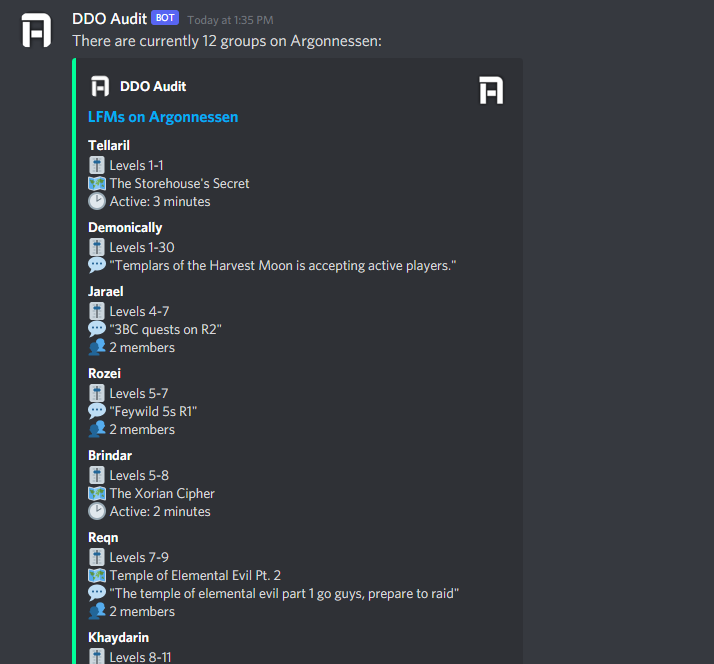
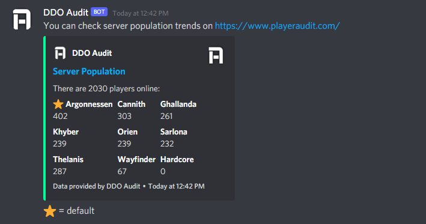

# Usage

The DDO Audit Discord bot provides server status, server population, and groups/LFMs for Dungeons & Dragons Online by utilizing APIs from the website of the same name. [Click here](https://discord.com/api/oauth2/authorize?client_id=771919729824497664&permissions=83968&scope=bot) to add the bot to your server.

Note: DDO Audit uses the `!` prefix.

## For Groups

Try `!groups servername [level|level-range|leader_name]` (e.g. `!groups thelanis` or `!groups thelanis 15-19` or `!groups thelanis clemeit`)

Result: A list of all public groups currently posted on the specified server and, if provided, matching the filter. The response will be deleted automatically after 5 minutes. You may append "save" to the end of the message to stop the message from being deleted (e.g. `!groups thelanis save`).

Notes on the filter parameter:

-  This field is optional.
-  Provide a single level (e.g. `20`) to see all groups that are accepting that character level.
-  Provide a level range (e.g. `15-19`) to see all groups within that range.
-  Provide a full or partial character name (e.g. `clemeit`) to see groups with leaders matching that name.

To see a screenshot of the LFM panel, try `!view servername`

Result: A full screenshot of the in-game LFM panel. The response will be deleted automatically after 5 minutes. You may append "save" to the end of the message to stop the message from being deleted (e.g. `!view thelanis save`).

Note: Append "large" to the end of the command (e.g. `!view thelanis large`) to increase the font size in the screenshot.

## For Server Status

Try `!serverstatus`

Result: Online/Offline status for DDO's servers.

## For Server Population

Try `!serverpop`

Result: Current population for each of DDO's servers.

# Adding This Bot

If you would like to add DDO Audit to a server on which you have the **Manage Server** permission, you may do so by clicking the following link:

https://discord.com/api/oauth2/authorize?client_id=771919729824497664&permissions=83968&scope=bot

# Permissions

DDO Audit requires the following permissions:

-  Send Messages (allows DDO Audit to post messages to your server in response to commands)
-  Embed Links (allows DDO Audit to embed link previews in its messages)
-  Read Message History (allows DDO Audit to read messages posted to you server; required for recognizing `!` commands)

# About

The DDO Audit Discord bot is an extension of DDO Audit. DDO Audit is in no way affiliated with or endorsed by Standing Stone Games or Daybreak Game Company. Visit the full project at www.playeraudit.com.

The DDO Audit Discord bot is open source. You're welcome to take a look around!

\- Clemeit of Thelanis
