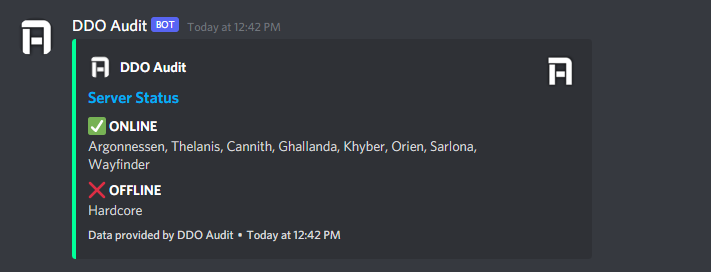

# Usage

The DDO Audit Discord bot provides server status, server population, and groups/LFMs for Dungeons & Dragons Online by utilizing APIs from the website of the same name.

DDO Audit uses the `!` prefix.

## For Server Status

Try `!serverstatus`

Result: Online/Offline status for DDO's servers.

## For Server Population

Try `!serverpop`

Result: Current population for each of DDO's servers.

## For Groups

Try `!groups servername` (e.g. `!groups thelanis`)

Result: A list of all public groups currently posted on the specified server.

# Adding This Bot

If you would like to add DDO Audit to a server on which you have the **Manage Server** permission, you may do so by clicking the following link:

https://discord.com/api/oauth2/authorize?client_id=771919729824497664&permissions=83968&scope=bot

# Permissions

DDO Audit requires the following permissions:

-  Send Messages (allows DDO Audit to post messages to your server in response to commands)
-  Embed Links (allows DDO Audit to embed link previews in its messages)
-  Read Message History (allows DDO Audit to read messages posted to you server; required for recognizing `!` commands)

DDO Audit does not store private user data or message history. The source code is available for your viewing.

# About

The DDO Audit Discord bot is an extension of DDO Audit. DDO Audit is in no way affiliated with or endorsed by Standing Stone Games or Daybreak Game Company. Visit the full project at www.playeraudit.com.

The DDO Audit Discord bot is open source. You're welcome to take a look around!

\- Clemeit of Thelanis
